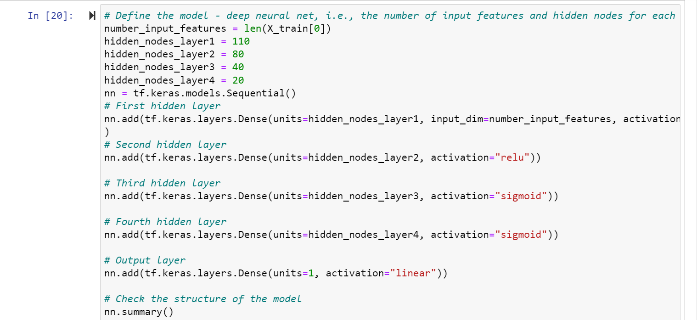

# Neural_Network_Charity_Analysis

## Overview

1. Compare the differences between the traditional machine learning classification and regression models and the neural network models.
2. Implement neural network models using TensorFlow.
3. Preprocess and construct datasets for neural network models.
4. Compare the differences between neural network models and deep neural networks.
5. Implement deep neural network models using TensorFlow.
6. Save trained TensorFlow models for later use.

## Purpose

The goal is to use machine learning and neural networks to apply features on a provided dataset to create a binary classifier that is capable of predicting whether applicants will be successful if funded by Alphabet Soup.

## Results:

### Data Preprocessing

1. What variable(s) are considered the target(s) for your model?
Checking to see if the target is marked as successful in the DataFrame, indicating that it has been successfully funded by AlphabetSoup.

2. What variable(s) are considered to be the features for your model?
The IS_SUCCESSFUL column is the feature chosen for this dataset.

3. What variable(s) are neither targets nor features, and should be removed from the input data?
The EIN and NAME columns will not increase the accuracy of the model and can be removed to improve code efficiency.

### Compiling, Training, and Evaluating the Model

1. How many neurons, layers, and activation functions did you select for your neural network model, and why?
In the optimized model, layer 1 started with 110 neurons with a relu activation. For layer 2, it dropped to 80 neurons and continued with the relu activation. From there, the sigmoid activation seemed to be the better fit for layers 3 (40 neurons) and layer 4 (20 neurons).

